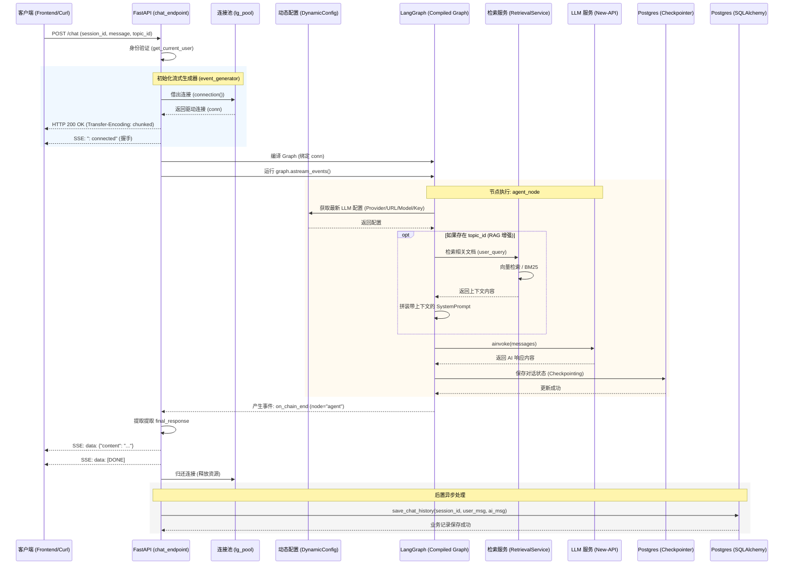

# MS Py Agent

A modular Python-based AI agent service built with FastAPI, integrating **Nacos** for service discovery and **Model Context Protocol (MCP)** for extensible tool usage. This agent uses **LangGraph** to orchestrate agentic workflows.

## Features

- **FastAPI Framework**: High-performance, easy-to-learn web framework.
- **Service Discovery**: Seamless integration with Nacos for service registration and discovery.
- **LangGraph**: Stateful, multi-actor applications with cycles (agentic orchestration).
- **Model Context Protocol (MCP)**:
    - **Stdio Client**: Connects to local CLI tools (e.g., Brave Search via Node.js).
    - **SSE Client**: Connects to remote services (e.g., Java backend) via Server-Sent Events.

## Prerequisites

- **Python 3.10+**
- **Node.js**: Required for running the Brave Search MCP server (`npx`).
- **Nacos Server 2.x**: A running Nacos instance is required for the application to start.

## Installation

1. Clone the repository:
   ```bash
   git clone <repository_url>
   cd ms-py-agent
   ```

2. Create and activate a virtual environment:
   ```bash
   python -m venv .venv
   # Windows
   .venv\Scripts\activate
   # Linux/Mac
   source .venv/bin/activate
   ```

3. Install dependencies:
   ```bash
   pip install -r requirements.txt
   ```

## Configuration

The application is configured via environment variables. You can create a `.env` file in the root directory (see `.env.example`).

| Variable | Default | Description |
|----------|---------|-------------|
| `APP_ENV` | `development` | Application environment (`development` or `production`). |
| `HOST` | `0.0.0.0` | Host to bind the server to. |
| `PORT` | `8181` | Port to listen on. |
| `NACOS_SERVER_ADDR` | `` | Address of the Nacos server. |
| `NACOS_NAMESPACE` | `public` | Nacos namespace ID. |
| `NACOS_USERNAME` | `` | Nacos username. |
| `NACOS_PASSWORD` | `` | Nacos password. |
| `SERVICE_NAME` | `ms-py-agent` | Name of this service in Nacos. |
| `MCP_BRAVE_PATH` | (Auto-detected) | Optional override for `npx` path. |
| `NACOS_GATEWAY_SERVICE_NAME` | `gateway` | Name of the Java/Gateway service to discover. |

## Usage

### Running the Application

Using `python`:
```bash
python main.py
```

Using `uvicorn` (with hot reload):
```bash
uvicorn main:app --reload --port 8181
```

> **Note**: The application will fail to start if it cannot connect to the configured Nacos server.

### API Endpoints

- **Health Check**: `GET /health`
- **Chat**: `POST /chat`
    ```json
    {
      "message": "Search for the latest news on AI."
    }
    ```

## Project Structure

The project follows a modular package structure:

```text
ms-py-agent/
├── app/
│   ├── core/           # Core configuration & infrastructure (Nacos, Config)
│   ├── services/       # External service clients (MCP)
│   ├── agent/          # LangGraph logic (State, Graph, Nodes)
│   └── setup.py        # Startup setup scripts
├── main.py             # Entry point
└── ...
```


# Chat Endpoint 详细执行流程分析

下面是 `/rest/dark/v1/agent/chat` 接口在一次完整请求中的时序图。

# Chat Endpoint 详细执行流程分析

下面是 `/rest/dark/v1/agent/chat` 接口在一次完整请求中的时序图。
为什么流程看起来很复杂？
连接隔离：为了保证 AI 状态持久化（Checkpointer）的鲁棒性，我们避开了常规的 SQLAlchemy，直接使用了底层的 psycopg 连接池。
异步流式解耦：为了让 AI 结果能“崩”出一个个字（或一段段话），代码必须处理复杂的事件循环，而不是简单的 return response。
多阶段执行：在 AI 说话之前，系统其实已经在后台默默完成了“查配置、查知识库、存状态、准备环境”等一系列动作。

chat_endpoint 看起来复杂，是因为它不仅仅是一个简单的“提问-回答”接口，而是一个集成了状态管理（Memory）、知识库检索（RAG）、流式响应（SSE）以及动态配置的复杂工作流系统。

以下是这个过程的详细拆解，以及为什么要这么设计：

1. 核心流程拆解
当你请求这个接口时，后台完整经历了以下 7 个阶段：

建立受控连接 (Connection Management)

动作：从专门的连接池 (lg_pool) 申请一个数据库连接。
原因：LangGraph 需要在数据库中实时读写聊天进度（Checkpoint）。我们手动管理连接是为了确保在流式输出的整个过程中，数据库连接是稳定且独占的，防止写状态时中断。
握手与心跳 (Handshake)

动作：立即 Yield 一个 : connected。
原因：由于 AI 响应可能很慢，这个“握手”能告诉前端（和服务端代理如 Nginx）：连接已连通，不要因为超时而切断请求。
编排“大脑” (Graph Compilation)

动作：根据当前连接初始化 StateGraph。
原因：系统使用的是 LangGraph，它允许我们将 AI 逻辑拆分成多个节点。即使是简单的对话，它也涉及“判断当前状态 -> 载入历史记录”的步骤。
动态 RAG 检索 (Retrieval-Augmented Generation)

动作：在 AI 思考前，如果带了 topic_id，它会去向量数据库检索相关知识。
原因：由于支持可配置的知识库，它会在 node 内部根据 topic_id 自动拼装上下文。
异步事件流 (Event Streaming)

动作：调用 astream_events 并迭代所有内部事件。
原因：AI 的运行分为“开始思考”、“检索中”、“调用 LLM”、“生成结果”等多个微小事件。我们在这里只过滤出 "agent" 节点的 on_chain_end 事件（即最终结果）发给前端。
事务回滚与归还连接

动作：async with 结束，自动释放连接。
原因：确保资源不泄露。
异步持久化历史记录 (History Save)

动作：在给用户发完数据后，单独开启一个 SQLAlchemy 事务，把对话存入业务表。
原因：解耦。保存历史记录不应该阻塞 AI 的输出，所以我们在流结束后异步完成。




